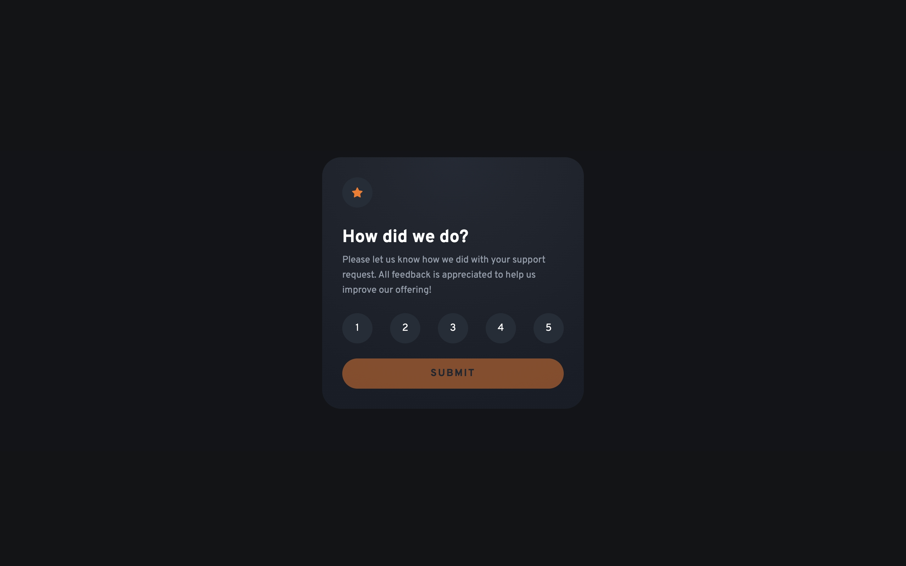
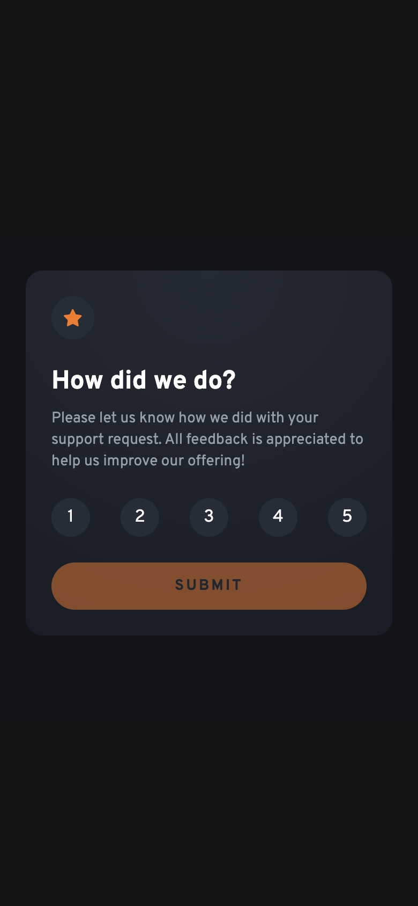

# Frontend Mentor - Interactive rating component solution

This is a solution to the [Interactive rating component challenge on Frontend Mentor](https://www.frontendmentor.io/challenges/interactive-rating-component-koxpeBUmI). Frontend Mentor challenges help you improve your coding skills by building realistic projects.

## Table of contents

- [Frontend Mentor - Interactive rating component solution](#frontend-mentor---interactive-rating-component-solution)
  - [Table of contents](#table-of-contents)
  - [Overview](#overview)
    - [The challenge](#the-challenge)
    - [Screenshot](#screenshot)
    - [Links](#links)
  - [My process](#my-process)
    - [Built with](#built-with)
    - [What I learned](#what-i-learned)
    - [Continued development](#continued-development)
    - [Useful resources](#useful-resources)
  - [Author](#author)

## Overview

### The challenge

Users should be able to:

- View the optimal layout for the app depending on their device's screen size
- See hover states for all interactive elements on the page
- Select and submit a number rating
- See the "Thank you" card state after submitting a rating
- Use number keys and enter to submit a rating

### Screenshot

Desktop

Mobile

### Links

- [Live Site URL](https://interactive-rating-component.frilly.dev/)

## My process

### Built with

- [SolidJS](https://www.solidjs.com/)
- [Tailwind CSS](https://tailwindcss.com/)
- [Astro](https://astro.build/)

### What I learned

I learned that Solid is a more refined version of React. What I don't like about React is that it's too verbose, like how looping requires you to do `.map` instead of a simple directive like `v-for` in Vue or `#each` in Svelte. Solid adds a `<For>` component that makes it cleaner. Similar thing to the chain of `v-if` and `v-else-if` in Vue, Solid has a `<Match>` component that makes it cleaner (no more crazy ternary trees yay).

At first I thought Solid would be like Preact, just the same thing but probably faster and lighter? (I haven't done much research into Preact, and maybe it will hold some surprises like Solid). There were a few hiccups along the way but overall I enjoyed using Solid, which was kinda surprising since I didn't like how React handles its components.

### Continued development

Definitely, I would want to use Solid more. I like the component's scoped styles in Astro, Vue, and Svelte. React and Solid don't have that, but they do support module CSS, which might be okay. Not a fan of having to swap between multiple tabs, but I guess it works. Vue's workflow with SFCs really made me create a lot of components, that may be unnecessary for Solid.

### Useful resources

- [Solid.js Docs](https://docs.solidjs.com) - The docs are really helpful. It also lists out cool built in components like `<For>` and `<Match>`.

## Author

- Website - [frilly.dev](https://frilly.dev)
- Frontend Mentor - [@hikawi](https://www.frontendmentor.io/profile/hikawi)
